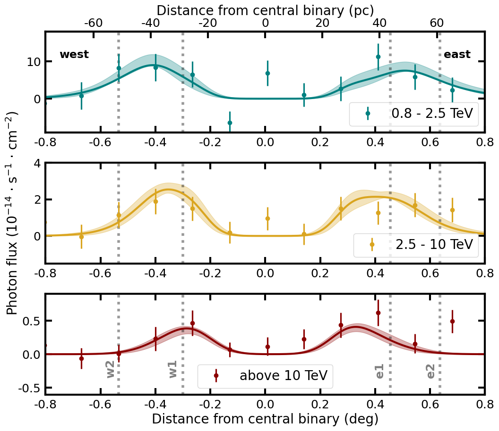

# particle-transport-1D
This repository contains code to simulate the one-dimensional transport of particles in an advective and diffusive flow, including particle cooling and radiation.
It uses [GAMERA](http://libgamera.github.io/GAMERA/docs/main_page.html) for the particle cooling and radiation and [Gammapy](https://docs.gammapy.org/stable/) for some convenience functions (although these are easy to replace if needed).

Additionally, the folder `ss433` contains the scripts and files needed to reproduce the Figure 3 from https://www.science.org/doi/10.1126/science.adi2048.

## Getting started
### 1. Install python environment
The code uses the Gammapy `MapAxis` class for convenience in several locations. If you don't want to install Gammapy, you can replace it wherever it is used.
Otherwise you just need to install Gammapy. We will use Gammapy 1.0.1. You can install it following the instructions [here](https://docs.gammapy.org/1.0.1/getting-started/index.html) or I've already included an `environment.yml` file in this repo, that is identical to the one for Gammapy 1.0.1. This installation uses the python package manager [Anaconda](https://docs.continuum.io/free/anaconda/).

```
conda env create -f environment.yml
conda activate particle-transport-1D
```

### 2. Install GAMERA
The instructions to install GAMERA are listed on their [website](http://libgamera.github.io/GAMERA/docs/download_installation.html). This code uses the Python binders (GAPPA).
Below are some snippets that are useful when installing in an Ubuntu machine with 18.04 or higher. For other machines (or any issues) please refer to the GAMERA documentation.

```
git clone https://github.com/libgamera/GAMERA.git
cd GAMERA
export GAMERA_DIR=$PWD
sudo apt install libgsl23 libgsl-dev swig python-dev pkg-config
make gappa
export PYTHONPATH="${PYTHONPATH}:${GAMERA_DIR}/lib/"
```

The last line will allow you to simply import `gappa` as a normal python package in that terminal instance, which is how it is used in these scripts. Alternatively, you can add this to the python scripts before `gappa` is imported:

```
import sys
sys.path.append('${GAMERA_DIR}/lib')
```

To test that everything worked correctly just type `python` in your terminal and then

```
import gappa as gp
import gammapy # if you installed Gammapy in step 1
```

## Code overview
The main functions are in the file `spatial_model.py`. This file defines a python class called `AdvectionInstance` which takes in the input parameters and can be used to derive the resulting spatial particle and radiation profiles. The two main steps (computationally speaking) are the construction of the particle distribution and the calculation of the radiation. These two steps have to be ran one after the other, and because they are time-consuming, the result is cached and only computed once.

To ilustrate this, let x be an instance of the `AdvectionInstance` class

```
_ = x.electron_dNdE # the electron distribution is computed in this step and saved to the instance x
_ = x.photon_distribution # the photon distribution is computed in this step and saved to the instance x
```

If any of those to methods are called again, the calculation isn't run again but the result derived earlier is given automatically. This has a **CAVEAT**. If one now changes a parameter of `x`, say

```
x.e_index = -1
```

The particle and radiation distributions **WILL NOT CHANGE OR BE RECALCULATED**. You need to define a new instance from scratch for that.

## Radiation fields
For the ambient radiation we use those from [Popescu et al 2017](https://ui.adsabs.harvard.edu/abs/2017MNRAS.470.2539P) at the location of SS 433 assuming a distance of 5.5 kpc. The files can be found in `files`.

## Simple example
A quick, fast example showing many diagnostic plots can be run with

```
python examples/simple_example.py
```

## Reproducing the results of the paper
The folder `ss433` contains the scripts and files needed to reproduce the Figure 4 from https://www.science.org/doi/10.1126/science.adi2048. This step requires Gammapy, which can be installed as described above. The plots can be reproduced without installing GAMERA as the output from this step is already in the repository, together with the code needed to reproduce them, which does need GAMERA. Reproducing the results requires the data associated to this paper, which can be downloaded from [here](). For convenience, I've put some of the lighter files in this repository.

### Figure 4
This figure shows the flux profiles along the jet for the same three energy bands together with a model derived used the `transport-1D-MC` code. We will first produce the model (this is the most time-consuming step) for both  by running:

```
python ss433/make_model.py
```
For convenience, the result of this step is already in this repository (`ss433/west.pkl` and `ss433/east.pkl`), so you can just skip to the next step and directly produce the figure.

The resulting `AdvectionInstance` will have been saved to a file, which we can read to derive the profile for the relevant energy bands and smooth it with the H.E.S.S. PSF. These steps are done by a function stored in the file `prepare_model.py`. To plot the model together with the data and reproduce figure 4, just run:

```
python ss433/fig4.py
```

The result should look like

